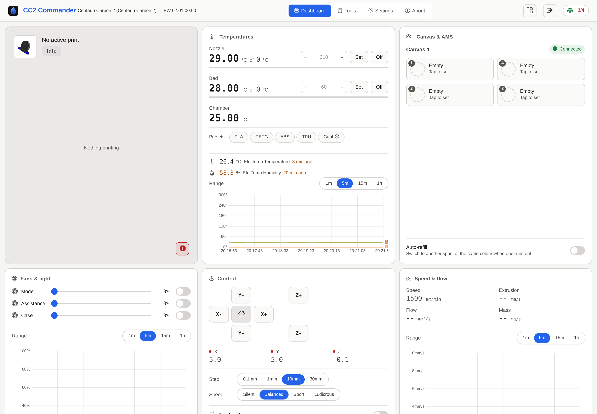
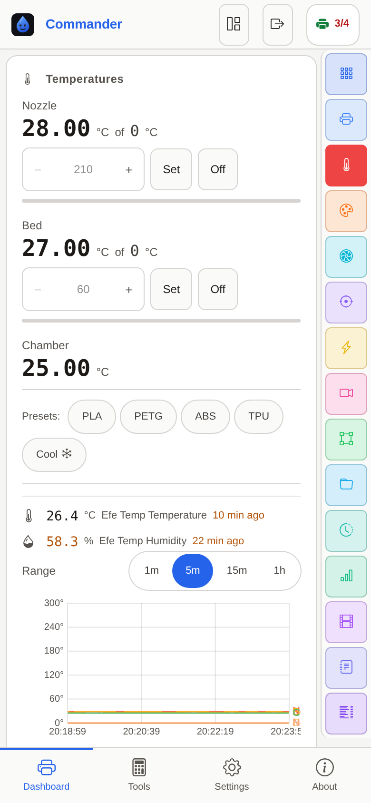
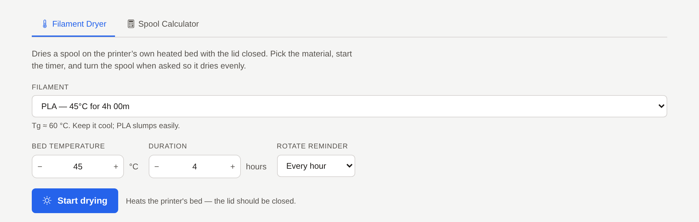

# CC2 Commander

A self-hosted web dashboard for the **Elegoo Centauri Carbon 2**. One Bun service holds
the printer's single MQTT slot and fans it out: to browsers over a WebSocket, to
Mainsail or Fluidd over a Moonraker-compatible API, and to Prometheus.



## What it does

- **Live dashboard**: temperatures, fans, speed and flow, toolhead position, Canvas/AMS
  spools and the camera, pushed as the printer reports them.
- **Print control**: start, pause, stop, move, home, temperature presets, LED,
  emergency stop. Controls that need an idle printer disable themselves when it isn't.
- **Files**: browse local and USB storage with thumbnails, upload, print, delete.
- **3D gcode preview**: Three.js toolpath with layer-follow and nozzle tracking.
- **Filament dryer**: uses the printer's own heated bed, and the timer lives in the
  *service*, so closing the tab cannot leave a hot bed with nothing to turn it off.
- **History, reports, timelapse**: past prints, PDF reports with charts, video download.
- **Telegram notifications**: print events, progress, camera snapshots.
- **Moonraker & OctoPrint APIs**: point Mainsail, Fluidd, KlipperScreen or an OctoPrint
  client at it.
- **Prometheus metrics** at `/api/metrics/prometheus`.
- **Works on a phone**: below 700px the grid becomes a one-card focus rail. Installable
  as a PWA.

<table>
<tr>
<td width="38%"></td>
<td><br>
<sub>The phone gets a one-card focus rail instead of the grid. The dryer runs in the
service rather than in a tab, so closing the page does not leave the bed hot.</sub></td>
</tr>
</table>

## Run it

Save this as `docker-compose.yml`, set your printer's address, and `docker compose up -d`:

```yaml
services:
  cc2-commander:
    image: ghcr.io/gren-95/cc2-commander:latest
    container_name: cc2-commander
    restart: unless-stopped
    ports:
      - "8088:8088"   # web UI, API and WebSocket
      - "7125:7125"   # Moonraker compatibility API
    environment:
      PRINTER_IP: "192.168.1.150"
    volumes:
      - ./elegoo-data:/app/data
```

Then open `http://localhost:8088`. The printer has to be in **LAN-only mode**.

That is the whole minimum. Passwords, Telegram, Home Assistant, camera overrides, image
tags and every other variable are in **[docs/configuration.md](docs/configuration.md)**.

> The `docker-compose.yml` in this repository is deliberately different: it **builds**
> from the checkout instead of pulling, because if you have the source, building what is
> in front of you is the thing that cannot be stale.

## Develop

```bash
bun install
bun run dev      # builds, serves on :8088, rebuilds on change
bun run gates    # lint, typecheck, dead code, build, unit + browser tests
```

There is also a container that keeps `node_modules`, the browsers and every generated
directory off your machine. See **[docs/development.md](docs/development.md)**.

## Documentation

| | |
|---|---|
| [Configuration](docs/configuration.md) | Docker, environment variables, auth, volumes, ports, deploying |
| [Development](docs/development.md) | Prerequisites, the dev container, building |
| [Architecture](docs/architecture.md) | How the pieces fit, and where a change belongs |
| [Protocol](docs/protocol.md) | The CC2 MQTT protocol, its quirks, zone detection, limits |
| [Security](docs/security.md) | What an unauthenticated request can reach, and secrets |
| [Gates](docs/gates.md) | What the checks prove, and what they do not |
| [Testing](docs/testing.md) | How the suites are organised |
| [Deployment](docs/deployment.md) | Why a merged commit is not a deployed one |
| [Dependencies](docs/dependencies.md) | What is pinned, and why |
| [Lessons](docs/lessons.md) | Things that cost a day and should not cost another |

## Supported printers

Elegoo Centauri Carbon 2, and other printers speaking the same CC2 protocol. Resin
printers (Mars, Saturn) use SDCP over WebSocket and are **not** supported.

## Credits

- [gcode-preview](https://github.com/remcoder/gcode-preview): Three.js toolpath rendering
- [elegoo-link](https://github.com/ELEGOO-3D/elegoo-link): Elegoo's official C++ SDK
- [elegoo-homeassistant](https://github.com/danielcherubini/elegoo-homeassistant): CC2 protocol documentation
- [Fluidd](https://github.com/fluidd-core/fluidd): UI inspiration
- [mqtt.js](https://github.com/mqttjs/MQTT.js): MQTT client

Forked from [runnane/elegoo-web](https://github.com/runnane/elegoo-web).

## License

MIT. See [LICENSE](LICENSE), which carries both the upstream author's copyright and this
fork's.
